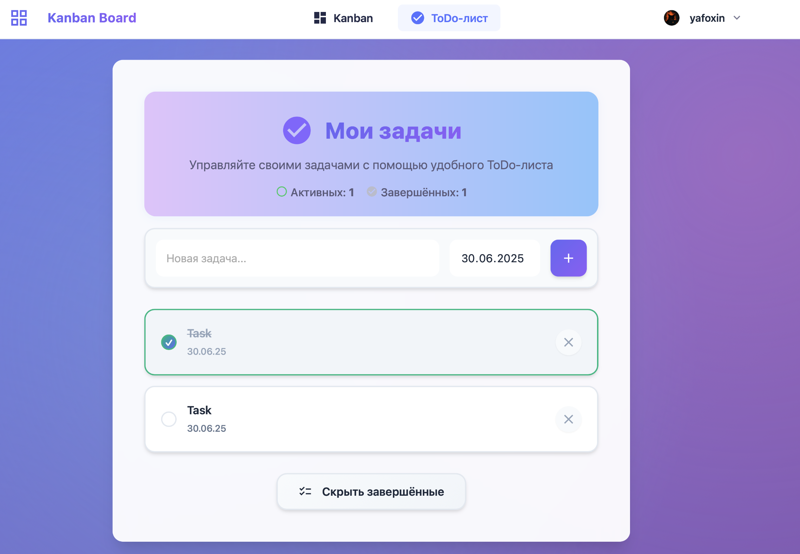

<div align="center">

# 🚀 KanbanFlow Pro

**Современная канбан-доска и система управления задачами**

[](https://flask.palletsprojects.com/)
[](https://www.postgresql.org/)
[](https://www.docker.com/)
[](LICENSE)
[](https://github.com/yafoxins/kanban-flask)

> **🎯 Полнофункциональная система управления проектами с канбан-доской, ToDo-листами и командной работой**

---

## 🌐 Живые демо

<table>
  <tr>
    <td align="center" width="50%">
      <b>🇷🇺 Работающее демо</b><br>
      <a href="https://kanban.yafoxin.ru">
        
      </a><br>
      <a href="https://kanban.yafoxin.ru">kanban.yafoxin.ru</a>
    </td>
    <td align="center" width="50%">
      <b>🇺🇸 Live Demo</b><br>
      <a href="https://kanban.yafoxin.tech">
        
      </a><br>
      <a href="https://kanban.yafoxin.tech">kanban.yafoxin.tech</a>
    </td>
  </tr>
</table>

---

**🎮 Попробуйте прямо сейчас!**  
Создайте аккаунт и испытайте все возможности системы.

---

<!-- Здесь можно вставить GIF/видео демонстрации -->
<!--  -->

---

[🇷🇺 Русский](#-русский) • [🇬🇧 English](#-english) • [🚀 Быстрый старт](#-быстрый-старт) • [🌟 Возможности](#-возможности) • [📱 Скриншоты](#-скриншоты) • [🛠️ Технологии](#️-технологии)

</div>

---

## 🇷🇺 Русский

### 🎯 О проекте

**KanbanFlow Pro** — это современное веб-приложение для управления задачами и проектами, построенное на Flask и PostgreSQL. Приложение объединяет в себе канбан-доску, ToDo-листы и систему командной работы в едином интуитивном интерфейсе.

**🌐 Работающее демо:** [kanban.yafoxin.ru](https://kanban.yafoxin.ru)

### ✨ Ключевые особенности

- 🎨 **Современный UI/UX** — Адаптивный дизайн с поддержкой темной/светлой темы
- 📋 **Канбан-доска** — Drag & Drop интерфейс с настраиваемыми статусами
- ✅ **ToDo-листы** — Персональные задачи с датами и приоритетами
- 👥 **Командная работа** — Создание команд, назначение задач, совместная работа
- 🔐 **Безопасность** — CSRF-защита, хеширование паролей, сессии
- 📱 **Адаптивность** — Полная поддержка мобильных устройств
- ⚡ **Real-time** — WebSocket для мгновенных обновлений
- 🖼️ **Медиа** — Загрузка изображений в задачи и аватаров

### 🏗️ Архитектура

```
┌─────────────────┐    ┌─────────────────┐    ┌─────────────────┐
│   Frontend      │    │   Backend       │    │   Database      │
│   (HTML/CSS/JS) │◄──►│   (Flask)       │◄──►│   (PostgreSQL)  │
└─────────────────┘    └─────────────────┘    └─────────────────┘
         │                       │                       │
         │              ┌─────────────────┐              │
         └──────────────►│   WebSocket     │◄─────────────┘
                        │   (Socket.IO)   │
                        └─────────────────┘
```

### 🚀 Быстрый старт

#### 🐳 Docker Compose (Рекомендуется)

```bash
# Клонирование репозитория
git clone https://github.com/yafoxins/kanban-flask.git
cd kanban-flask

# Запуск с Docker Compose
docker-compose up --build -d

# Открыть в браузере
open http://localhost
```

#### 🛠️ Ручная установка

```bash
# Клонирование и настройка
git clone https://github.com/yafoxins/kanban-flask.git
cd kanban-flask

# Создание виртуального окружения
python3 -m venv venv
source venv/bin/activate  # Linux/Mac
# или
venv\Scripts\activate     # Windows

# Установка зависимостей
pip install -r requirements.txt

# Настройка PostgreSQL
sudo -u postgres psql
CREATE DATABASE kanban_db;
CREATE USER kanban_user WITH PASSWORD 'kanban_pass';
GRANT ALL PRIVILEGES ON DATABASE kanban_db TO kanban_user;
\q

# Запуск приложения
python app.py
```

### 🌟 Возможности

#### 📋 Канбан-доска
- **Drag & Drop** — Перетаскивание задач между статусами
- **Настраиваемые статусы** — Создание и удаление колонок
- **Детальные задачи** — Описания, теги, даты, изображения
- **Редактирование** — Полное управление задачами
- **Поиск и фильтрация** — Быстрый поиск по задачам

#### ✅ ToDo-листы
- **Персональные задачи** — Приватные списки дел
- **Даты выполнения** — Планирование по времени
- **Статусы** — Отметка выполненных задач
- **Быстрое добавление** — Мгновенное создание задач

#### 👥 Командная работа
- **Создание команд** — Объединение пользователей
- **Назначение задач** — Распределение работы
- **Командные доски** — Общие канбан-доски
- **Роли** — Лидеры команд и участники
- **Real-time обновления** — Мгновенная синхронизация

#### 👤 Профиль пользователя
- **Редактирование данных** — Имя, email, страна
- **Смена пароля** — Безопасное обновление
- **Аватары** — Загрузка профильных фото
- **Темы** — Переключение между темной/светлой темой

---

## 🇬🇧 English

### 🎯 About Project

**KanbanFlow Pro** is a modern web application for task and project management, built on Flask and PostgreSQL. The application combines kanban boards, todo lists, and team collaboration in a single intuitive interface.

**🌐 Demo for Americans:** [kanban.yafoxin.tech](https://kanban.yafoxin.tech)

### ✨ Key Features

- 🎨 **Modern UI/UX** — Responsive design with dark/light theme support
- 📋 **Kanban Board** — Drag & Drop interface with customizable statuses
- ✅ **Todo Lists** — Personal tasks with dates and priorities
- 👥 **Team Collaboration** — Create teams, assign tasks, work together
- 🔐 **Security** — CSRF protection, password hashing, sessions
- 📱 **Responsive** — Full mobile device support
- ⚡ **Real-time** — WebSocket for instant updates
- 🖼️ **Media** — Image uploads in tasks and avatars

### 🚀 Quick Start

#### 🐳 Docker Compose (Recommended)

```bash
# Clone repository
git clone https://github.com/yafoxins/kanban-flask.git
cd kanban-flask

# Run with Docker Compose
docker-compose up --build -d

# Open in browser
open http://localhost
```

#### 🛠️ Manual Installation

```bash
# Clone and setup
git clone https://github.com/yafoxins/kanban-flask.git
cd kanban-flask

# Create virtual environment
python3 -m venv venv
source venv/bin/activate  # Linux/Mac
# or
venv\Scripts\activate     # Windows

# Install dependencies
pip install -r requirements.txt

# Setup PostgreSQL
sudo -u postgres psql
CREATE DATABASE kanban_db;
CREATE USER kanban_user WITH PASSWORD 'kanban_pass';
GRANT ALL PRIVILEGES ON DATABASE kanban_db TO kanban_user;
\q

# Run application
python app.py
```

### 🌟 Features

#### 📋 Kanban Board
- **Drag & Drop** — Drag tasks between statuses
- **Customizable Statuses** — Create and delete columns
- **Detailed Tasks** — Descriptions, tags, dates, images
- **Editing** — Full task management
- **Search & Filter** — Quick task search

#### ✅ Todo Lists
- **Personal Tasks** — Private to-do lists
- **Due Dates** — Time planning
- **Statuses** — Mark completed tasks
- **Quick Add** — Instant task creation

#### 👥 Team Collaboration
- **Create Teams** — Unite users
- **Assign Tasks** — Distribute work
- **Team Boards** — Shared kanban boards
- **Roles** — Team leaders and members
- **Real-time Updates** — Instant synchronization

#### 👤 User Profile
- **Edit Data** — Name, email, country
- **Change Password** — Secure update
- **Avatars** — Upload profile photos
- **Themes** — Switch between dark/light theme

---

## 📱 Скриншоты / Screenshots

<!-- Здесь можно добавить скриншоты интерфейса -->
<!--  -->
<!--  -->
<!--  -->

---

## 🛠️ Технологии / Technologies

### Backend
- **Flask 2.3.3+** — Веб-фреймворк / Web framework
- **PostgreSQL 16+** — База данных / Database
- **Flask-SocketIO** — WebSocket поддержка / WebSocket support
- **Werkzeug** — Утилиты безопасности / Security utilities
- **Eventlet** — Асинхронный сервер / Async server

### Frontend
- **HTML5/CSS3** — Современная разметка и стили / Modern markup and styles
- **JavaScript (ES6+)** — Интерактивность / Interactivity
- **Socket.IO** — Real-time обновления / Real-time updates
- **Sortable.js** — Drag & Drop функциональность / Drag & Drop functionality
- **Quill.js** — Rich text редактор / Rich text editor

### DevOps
- **Docker** — Контейнеризация / Containerization
- **Docker Compose** — Оркестрация / Orchestration
- **Nginx** — Обратный прокси / Reverse proxy
- **PostgreSQL** — Производственная БД / Production DB

---

## 📁 Структура проекта / Project Structure

```
kanban-flask/
├── 📄 app.py                 # Основное Flask приложение / Main Flask app
├── 🐳 docker-compose.yml     # Docker Compose конфигурация / Docker Compose config
├── 🐳 Dockerfile             # Docker образ / Docker image
├── 🌐 nginx.conf             # Nginx конфигурация / Nginx config
├── 📋 requirements.txt       # Python зависимости / Python dependencies
├── 📁 static/                # Статические файлы / Static files
│   ├── 🎨 css/               # Стили / Styles
│   ├── ⚡ js/                 # JavaScript
│   ├── 👤 avatars/           # Аватары пользователей / User avatars
│   ├── 📸 uploads/           # Загруженные изображения / Uploaded images
│   └── 🌍 countries.js       # Список стран / Countries list
├── 📁 templates/             # HTML шаблоны / HTML templates
│   ├── 🏠 home.html          # Главная страница / Home page
│   ├── 📋 kanban.html        # Канбан-доска / Kanban board
│   ├── ✅ todo.html          # ToDo-лист / Todo list
│   ├── 👥 team_board.html    # Командная доска / Team board
│   └── ✏️ task_*.html        # Редактирование задач / Task editing
└── 📖 README.md              # Документация / Documentation
```

---

## 🔧 API Endpoints

### Аутентификация / Authentication
- `POST /api/register` — Регистрация / Registration
- `POST /api/login` — Вход / Login
- `GET /<username>/logout` — Выход / Logout

### Канбан / Kanban
- `GET /<username>/api/statuses` — Получение статусов / Get statuses
- `POST /<username>/api/statuses` — Создание статуса / Create status
- `GET /<username>/api/tasks` — Получение задач / Get tasks
- `POST /<username>/api/tasks` — Создание задачи / Create task
- `PATCH /<username>/api/tasks/<id>` — Обновление задачи / Update task

### ToDo
- `GET /<username>/api/todos` — Получение ToDo / Get todos
- `POST /<username>/api/todos` — Создание ToDo / Create todo
- `PATCH /<username>/api/todos/<id>` — Обновление ToDo / Update todo

### Команды / Teams
- `POST /<username>/api/teams` — Создание команды / Create team
- `GET /<username>/api/teams/list` — Список команд / List teams
- `POST /<username>/api/teams/<id>/members` — Добавление участника / Add member

---

## 🚀 Развертывание / Deployment

### Production с Docker / Production with Docker

```bash
# Клонирование / Clone
git clone https://github.com/yafoxins/kanban-flask.git
cd kanban-flask

# Запуск / Run
docker-compose up -d
```

### Production без Docker / Production without Docker

```bash
# Установка зависимостей / Install dependencies
pip install -r requirements.txt

# Настройка PostgreSQL / Setup PostgreSQL
sudo -u postgres createdb kanban_db
sudo -u postgres createuser kanban_user

# Настройка Nginx / Setup Nginx
sudo cp nginx.conf /etc/nginx/sites-available/kanban
sudo ln -s /etc/nginx/sites-available/kanban /etc/nginx/sites-enabled/

# Запуск с Gunicorn / Run with Gunicorn
gunicorn -w 4 -k gevent --worker-connections 1000 app:app
```

---

## 🔒 Безопасность / Security

- **CSRF Protection** — Защита от межсайтовых запросов / Cross-site request forgery protection
- **Password Hashing** — Хеширование паролей с bcrypt / Password hashing with bcrypt
- **Session Management** — Управление сессиями / Session management
- **Input Validation** — Валидация входных данных / Input validation
- **SQL Injection Protection** — Защита от SQL-инъекций / SQL injection protection
- **XSS Protection** — Защита от XSS-атак / XSS attack protection

---

## 🤝 Вклад в проект / Contributing

1. **Fork** репозитория / Fork the repository
2. Создайте **feature branch** (`git checkout -b feature/AmazingFeature`) / Create feature branch
3. **Commit** изменения (`git commit -m 'Add AmazingFeature'`) / Commit changes
4. **Push** в branch (`git push origin feature/AmazingFeature`) / Push to branch
5. Откройте **Pull Request** / Open Pull Request

---

## 📄 Лицензия / License

Этот проект распространяется под лицензией **GPL-3.0**. См. файл [LICENSE](LICENSE) для подробностей.

This project is licensed under **GPL-3.0**. See the [LICENSE](LICENSE) file for details.

---

## 👨‍💻 Автор / Author

**Yafoxin** — [@yafoxin](https://t.me/yafoxin)

- 🌐 **Website**: [yafoxin.ru](https://yafoxin.ru)
- 💬 **Telegram**: [@yafoxins](https://t.me/yafoxins)

---

<div align="center">

### ⭐ Если проект вам понравился, поставьте звездочку! / If you like the project, give it a star!

[](https://github.com/yafoxins/kanban-flask/stargazers)
[](https://github.com/yafoxins/kanban-flask/network/members)
[](https://github.com/yafoxins/kanban-flask/issues)

---

**Made with ❤️ by Yafoxin**

</div>
