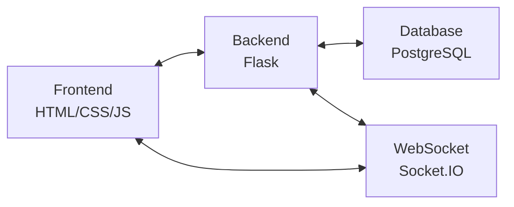

<div align="center">

# 🚀 KanbanFlow Pro

**Современная канбан-доска и система управления задачами**  
**A modern Kanban board and task management system**

[](https://flask.palletsprojects.com/)
[](https://www.postgresql.org/)
[](https://www.docker.com/)
[](LICENSE)
[](https://github.com/yafoxins/kanban-flask)

<!-- Главный скриншот -->
<p align="center">
  
  <br>
  <i>Главная страница / Main page</i>
</p>

</div>

> **🎯 Полнофункциональная система управления проектами с канбан-доской, ToDo-листами и командной работой**  
> **🎯 Full-featured project management system with Kanban board, ToDo lists, and team collaboration**

---

<table align="center">
  <tr>
    <td align="center"><a href="#-русский">🇷🇺<br>Русский</a></td>
    <td align="center"><a href="#-english">🇬🇧<br>English</a></td>
    <td align="center"><a href="#-быстрый-старт">🚀<br>Быстрый старт</a></td>
    <td align="center"><a href="#-возможности">🌟<br>Возможности</a></td>
    <td align="center"><a href="#-скриншоты--screenshots">📱<br>Скриншоты</a></td>
    <td align="center"><a href="#️-технологии--technologies">🛠️<br>Технологии</a></td>
  </tr>
</table>

### 🆕 New Features / Новые возможности
- **🖼️ Avatar System / Система аватаров** - profile image uploads / загрузка профильных изображений
- **🖼️ Media in Tasks / Медиа в задачах** - image support in descriptions / поддержка изображений в описаниях
- **🔍 Enhanced Search / Расширенный поиск** - improved task filtering / улучшенная фильтрация задач
- **📊 Team Statistics / Статистика команд** - team collaboration analytics / аналитика по командной работе

### 🤖 Telegram Bot Integration / Интеграция с Telegram ботом
- **🔗 Account Linking / Привязка аккаунта** - link your Telegram account to your website profile / свяжите ваш Telegram с профилем на сайте
- **📨 Smart Notifications / Умные уведомления** - get notifications about task assignments and mentions / получайте уведомления о назначении задач и упоминаниях
- **⏰ Automatic Reminders / Автоматические напоминания** - deadline reminders 1-3 days in advance / уведомления о дедлайнах за 1-3 дня
- **🚨 Stuck Task Monitoring / Мониторинг зависших задач** - notifications about tasks not updated for over 7 days / уведомления о задачах, которые не обновлялись более 7 дней
- **📊 Weekly Reports / Еженедельные отчёты** - automatic reports for team owners / автоматические отчёты владельцам команд
- **💬 Comment Mentions / Упоминания в комментариях** - notifications when mentioned with @username in comments / уведомления при упоминании @username в комментариях

### 🎨 Enhanced Interface / Улучшенный интерфейс
- **📝 Rich Text Editor / Rich Text Editor** - full-featured editor with formatting for task descriptions / полноценный редактор с форматированием для описаний задач
- **🏷️ Tag System / Система тегов** - predefined tags: Urgent, Bug, Enhancement, Discuss, Documents / предустановленные теги: Срочно, Баг, Улучшение, Обсудить, Документы
- **📅 Enhanced Dates / Улучшенные даты** - task planning with deadlines / планирование задач с дедлайнами
- **💬 Enhanced Comments / Улучшенные комментарии** - auto-scroll, new comment indicators, mentions / автопрокрутка, индикаторы новых комментариев, упоминания
- **🎯 Drag & Drop / Drag & Drop** - drag and drop task movement between statuses with animations / перетаскивание задач между статусами с анимациями
- **📱 Responsive Design / Адаптивный дизайн** - full mobile device support / полная поддержка мобильных устройств

### ⚡ Performance / Производительность
- **🔄 Real-time Updates / Real-time обновления** - instant synchronization via WebSocket / мгновенная синхронизация через WebSocket
- **📦 Docker Ready / Docker готовность** - full containerization with nginx / полная контейнеризация с nginx
- **🗄️ Optimized Database / Оптимизированная БД** - improved queries and indexes / улучшенные запросы и индексы
- **🎨 Caching / Кэширование** - caching for static files and images / кэширование статических файлов и изображений

---

<div align="center">

## 🌐 Живые демо / Live Demo

<table>
  <tr>
    <td align="center" width="50%">
      <b>🇷🇺 Работающее демо</b><br>
      <a href="https://kanban.yafoxin.ru">
        
      </a>
    </td>
    <td align="center" width="50%">
      <b>🇺🇸 Live Demo</b><br>
      <a href="https://kanban.yafoxin.tech">
        
      </a>
    </td>
  </tr>
</table>

**🎮 Попробуйте прямо сейчас!**  
Создайте аккаунт и испытайте все возможности системы.

</div>

---

<!-- Здесь можно вставить GIF/видео демонстрации -->
<!--  -->

---

## 🇷🇺 Русский

### 🎯 О проекте

**KanbanFlow Pro** — это современное веб-приложение для управления задачами и проектами, построенное на Flask и PostgreSQL. Приложение объединяет в себе канбан-доску, ToDo-листы и систему командной работы в едином интуитивно-понятном интерфейсе.

**🌐 Работающее демо:** [kanban.yafoxin.ru](https://kanban.yafoxin.ru)

### 🏗️ Архитектура / Architecture



**🇷🇺 Архитектура проекта** — Вся система построена по принципу клиент-сервер с поддержкой real-time через WebSocket.  
**🇬🇧 Project architecture** — The whole system is built on a client-server principle with real-time support via WebSocket.

### ✨ Ключевые особенности

<table>
  <tr><td>🎨 Современный UI/UX</td><td>Адаптивный дизайн с красивыми анимациями</td></tr>
  <tr><td>📋 Канбан-доска</td><td>Drag & Drop интерфейс с настраиваемыми статусами</td></tr>
  <tr><td>✅ ToDo-листы</td><td>Персональные задачи с датами и приоритетами</td></tr>
  <tr><td>👥 Командная работа</td><td>Создание команд, назначение задач, совместная работа</td></tr>
  <tr><td>🔐 Безопасность</td><td>CSRF-защита, хеширование паролей, сессии</td></tr>
  <tr><td>📱 Адаптивность</td><td>Полная поддержка мобильных устройств</td></tr>
  <tr><td>⚡ Real-time</td><td>WebSocket для мгновенных обновлений</td></tr>
  <tr><td>🖼️ Медиа</td><td>Загрузка изображений в задачи и аватаров</td></tr>
</table>

### 🚀 Быстрый старт

#### 🐳 Docker Compose (Рекомендуется)

```bash
# Клонирование репозитория
git clone https://github.com/yafoxins/kanban-flask.git
cd kanban-flask

# Запуск с Docker Compose
docker-compose up --build -d

# Открыть в браузере
open http://localhost
```

#### 🔧 Настройка переменных окружения / Environment Variables Setup
```bash
# 1. Скопируйте пример файла
cp env.example .env

# 2. Отредактируйте .env файл с вашими настройками:
# === Настройки базы данных ===
DATABASE_URL=postgres://kanban_user:kanban_pass@db:5432/kanban_db

# === Telegram Bot Token ===
TELEGRAM_BOT_TOKEN=your_bot_token_here

# === Настройки Flask ===
FLASK_HOST=0.0.0.0
FLASK_PORT=5000
FLASK_DEBUG=false
SECRET_KEY=your_secret_key_here
SESSION_LIFETIME=1800

# === Настройки загрузки файлов ===
UPLOAD_FOLDER=static/uploads
MAX_CONTENT_LENGTH=16777216

# === Настройки PostgreSQL ===
POSTGRES_USER=kanban_user
POSTGRES_PASSWORD=kanban_pass
POSTGRES_DB=kanban_db
BASE_URL=https://your-domain.com
```

#### 🤖 Настройка Telegram бота / Telegram Bot Setup
```bash
# 1. Создайте бота через @BotFather в Telegram
# 2. Получите токен бота
# 3. Добавьте токен в .env файл:
TELEGRAM_BOT_TOKEN=your_bot_token_here

# 4. Перезапустите приложение
docker-compose restart
```

#### 🛠️ Ручная установка

```bash
# Клонирование и настройка
git clone https://github.com/yafoxins/kanban-flask.git
cd kanban-flask

# Создание виртуального окружения
python3 -m venv venv
source venv/bin/activate  # Linux/Mac
# или
venv\Scripts\activate     # Windows

# Установка зависимостей
pip install -r requirements.txt

# Настройка PostgreSQL
sudo -u postgres psql
CREATE DATABASE kanban_db;
CREATE USER kanban_user WITH PASSWORD 'kanban_pass';
GRANT ALL PRIVILEGES ON DATABASE kanban_db TO kanban_user;
\q

# Запуск приложения
python app.py
```

### 🌟 Возможности

<table>
  <tr>
    <td>📋 <b>Канбан-доска</b></td>
    <td>
      Drag & Drop — Перетаскивание задач между статусами<br>
      Настраиваемые статусы — Создание и удаление колонок<br>
      Детальные задачи — Описания, теги, даты, изображения<br>
      Редактирование — Полное управление задачами<br>
      Поиск и фильтрация — Быстрый поиск по задачам
    </td>
  </tr>
  <tr>
    <td>✅ <b>ToDo-листы</b></td>
    <td>
      Персональные задачи — Приватные списки дел<br>
      Даты выполнения — Планирование по времени<br>
      Статусы — Отметка выполненных задач<br>
      Быстрое добавление — Мгновенное создание задач
    </td>
  </tr>
  <tr>
    <td>👥 <b>Командная работа</b></td>
    <td>
      Создание команд — Объединение пользователей<br>
      Назначение задач — Распределение работы<br>
      Командные доски — Общие канбан-доски<br>
      Роли — Лидеры команд и участники<br>
      Real-time обновления — Мгновенная синхронизация
    </td>
  </tr>
  <tr>
    <td>👤 <b>Профиль пользователя</b></td>
    <td>
      Редактирование данных — Имя, email, страна<br>
      Смена пароля — Безопасное обновление<br>
      Аватары — Загрузка профильных фото<br>
      Современный дизайн — Красивые анимации и интерфейс
    </td>
  </tr>
</table>

### 🆕 Новые возможности / New Features
- **🖼️ Система аватаров / Avatar System** - загрузка профильных изображений / profile image uploads
- **🖼️ Медиа в задачах / Media in Tasks** - поддержка изображений в описаниях / image support in descriptions
- **🔍 Расширенный поиск / Enhanced Search** - улучшенная фильтрация задач / improved task filtering
- **📊 Статистика команд / Team Statistics** - аналитика по командной работе / team collaboration analytics

### 🤖 Telegram Bot Integration / Интеграция с Telegram ботом
- **🔗 Привязка аккаунта** - свяжите ваш Telegram с профилем на сайте / Link your Telegram account to your website profile
- **📨 Умные уведомления** - получайте уведомления о назначении задач и упоминаниях / Get smart notifications about task assignments and mentions
- **⏰ Автоматические напоминания** - уведомления о дедлайнах за 1-3 дня / Automatic deadline reminders 1-3 days in advance
- **🚨 Мониторинг зависших задач** - уведомления о задачах, которые не обновлялись более 7 дней / Monitor stuck tasks that haven't been updated for over 7 days
- **📊 Еженедельные отчёты** - автоматические отчёты владельцам команд / Weekly reports for team owners
- **💬 Упоминания в комментариях** - уведомления при упоминании @username в комментариях / Mentions in comments with @username notifications

### 🎨 Улучшенный интерфейс / Enhanced Interface
- **📝 Rich Text Editor** - полноценный редактор с форматированием для описаний задач / Full-featured rich text editor for task descriptions
- **🏷️ Система тегов** - предустановленные теги: Срочно, Баг, Улучшение, Обсудить, Документы / Tag system with predefined tags: Urgent, Bug, Enhancement, Discuss, Documents
- **📅 Улучшенные даты** - планирование задач с дедлайнами / Enhanced date planning with deadlines
- **💬 Улучшенные комментарии** - автопрокрутка, индикаторы новых комментариев, упоминания / Enhanced comments with auto-scroll, new comment indicators, mentions
- **🎯 Drag & Drop** - перетаскивание задач между статусами с анимациями / Drag & drop task movement between statuses with animations
- **📱 Адаптивный дизайн** - полная поддержка мобильных устройств / Full mobile device support

### ⚡ Производительность / Performance
- **🔄 Real-time обновления** - мгновенная синхронизация через WebSocket / Instant synchronization via WebSocket
- **📦 Docker готовность** - полная контейнеризация с nginx / Full containerization with nginx
- **🗄️ Оптимизированная БД** - улучшенные запросы и индексы / Optimized database queries and indexes
- **🎨 Кэширование** - кэширование статических файлов и изображений / Caching for static files and images

---

## 🇬🇧 English

### 🎯 About Project

**KanbanFlow Pro** is a modern web application for task and project management, built on Flask and PostgreSQL. The application combines kanban boards, todo lists, and team collaboration in a single intuitive interface.

**🌐 Demo for Americans:** [kanban.yafoxin.tech](https://kanban.yafoxin.tech)

### ✨ Key Features

<table>
  <tr><td>🎨 Modern UI/UX</td><td>Responsive design with beautiful animations</td></tr>
  <tr><td>📋 Kanban Board</td><td>Drag & Drop interface with customizable statuses</td></tr>
  <tr><td>✅ Todo Lists</td><td>Personal tasks with dates and priorities</td></tr>
  <tr><td>👥 Team Collaboration</td><td>Create teams, assign tasks, work together</td></tr>
  <tr><td>🔐 Security</td><td>CSRF protection, password hashing, sessions</td></tr>
  <tr><td>📱 Responsive</td><td>Full mobile device support</td></tr>
  <tr><td>⚡ Real-time</td><td>WebSocket for instant updates</td></tr>
  <tr><td>🖼️ Media</td><td>Image uploads in tasks and avatars</td></tr>
</table>

### 🚀 Quick Start

#### 🐳 Docker Compose (Recommended)

```bash
# Clone repository
git clone https://github.com/yafoxins/kanban-flask.git
cd kanban-flask

# Run with Docker Compose
docker-compose up --build -d

# Open in browser
open http://localhost
```

#### 🔧 Environment Variables Setup / Настройка переменных окружения
```bash
# 1. Copy the example file
cp env.example .env

# 2. Edit .env file with your settings:
# === Database Settings ===
DATABASE_URL=postgres://kanban_user:kanban_pass@db:5432/kanban_db

# === Telegram Bot Token ===
TELEGRAM_BOT_TOKEN=your_bot_token_here

# === Flask Settings ===
FLASK_HOST=0.0.0.0
FLASK_PORT=5000
FLASK_DEBUG=false
SECRET_KEY=your_secret_key_here
SESSION_LIFETIME=1800

# === File Upload Settings ===
UPLOAD_FOLDER=static/uploads
MAX_CONTENT_LENGTH=16777216

# === PostgreSQL Settings ===
POSTGRES_USER=kanban_user
POSTGRES_PASSWORD=kanban_pass
POSTGRES_DB=kanban_db
BASE_URL=https://your-domain.com
```

#### 🤖 Telegram Bot Setup / Настройка Telegram бота
```bash
# 1. Create a bot via @BotFather in Telegram
# 2. Get the bot token
# 3. Add the token to .env file:
TELEGRAM_BOT_TOKEN=your_bot_token_here

# 4. Restart the application
docker-compose restart
```

#### 🛠️ Manual Installation

```bash
# Clone and setup
git clone https://github.com/yafoxins/kanban-flask.git
cd kanban-flask

# Create virtual environment
python3 -m venv venv
source venv/bin/activate  # Linux/Mac
# or
venv\Scripts\activate     # Windows

# Install dependencies
pip install -r requirements.txt

# Setup PostgreSQL
sudo -u postgres psql
CREATE DATABASE kanban_db;
CREATE USER kanban_user WITH PASSWORD 'kanban_pass';
GRANT ALL PRIVILEGES ON DATABASE kanban_db TO kanban_user;
\q

# Run application
python app.py
```

### 🌟 Features

<table>
  <tr>
    <td>📋 <b>Kanban Board</b></td>
    <td>
      Drag & Drop — Drag tasks between statuses<br>
      Customizable Statuses — Create and delete columns<br>
      Detailed Tasks — Descriptions, tags, dates, images<br>
      Editing — Full task management<br>
      Search & Filter — Quick task search
    </td>
  </tr>
  <tr>
    <td>✅ <b>Todo Lists</b></td>
    <td>
      Personal Tasks — Private to-do lists<br>
      Due Dates — Time planning<br>
      Statuses — Mark completed tasks<br>
      Quick Add — Instant task creation
    </td>
  </tr>
  <tr>
    <td>👥 <b>Team Collaboration</b></td>
    <td>
      Create Teams — Unite users<br>
      Assign Tasks — Distribute work<br>
      Team Boards — Shared kanban boards<br>
      Roles — Team leaders and members<br>
      Real-time Updates — Instant synchronization
    </td>
  </tr>
  <tr>
    <td>👤 <b>User Profile</b></td>
    <td>
      Edit Data — Name, email, country<br>
      Change Password — Secure update<br>
      Avatars — Upload profile photos<br>
      Modern Design — Beautiful animations and interface
    </td>
  </tr>
</table>

### 🆕 Новые возможности / New Features
- **🖼️ Система аватаров / Avatar System** - загрузка профильных изображений / profile image uploads
- **🖼️ Медиа в задачах / Media in Tasks** - поддержка изображений в описаниях / image support in descriptions
- **🔍 Расширенный поиск / Enhanced Search** - улучшенная фильтрация задач / improved task filtering
- **📊 Статистика команд / Team Statistics** - аналитика по командной работе / team collaboration analytics

### 🤖 Telegram Bot Integration / Интеграция с Telegram ботом
- **🔗 Привязка аккаунта** - свяжите ваш Telegram с профилем на сайте / Link your Telegram account to your website profile
- **📨 Умные уведомления** - получайте уведомления о назначении задач и упоминаниях / Get smart notifications about task assignments and mentions
- **⏰ Автоматические напоминания** - уведомления о дедлайнах за 1-3 дня / Automatic deadline reminders 1-3 days in advance
- **🚨 Мониторинг зависших задач** - уведомления о задачах, которые не обновлялись более 7 дней / Monitor stuck tasks that haven't been updated for over 7 days
- **📊 Еженедельные отчёты** - автоматические отчёты владельцам команд / Weekly reports for team owners
- **💬 Упоминания в комментариях** - уведомления при упоминании @username в комментариях / Mentions in comments with @username notifications

### 🎨 Улучшенный интерфейс / Enhanced Interface
- **📝 Rich Text Editor** - полноценный редактор с форматированием для описаний задач / Full-featured rich text editor for task descriptions
- **🏷️ Система тегов** - предустановленные теги: Срочно, Баг, Улучшение, Обсудить, Документы / Tag system with predefined tags: Urgent, Bug, Enhancement, Discuss, Documents
- **📅 Улучшенные даты** - планирование задач с дедлайнами / Enhanced date planning with deadlines
- **💬 Улучшенные комментарии** - автопрокрутка, индикаторы новых комментариев, упоминания / Enhanced comments with auto-scroll, new comment indicators, mentions
- **🎯 Drag & Drop** - перетаскивание задач между статусами с анимациями / Drag & drop task movement between statuses with animations
- **📱 Адаптивный дизайн** - полная поддержка мобильных устройств / Full mobile device support

### ⚡ Производительность / Performance
- **🔄 Real-time обновления** - мгновенная синхронизация через WebSocket / Instant synchronization via WebSocket
- **📦 Docker готовность** - полная контейнеризация с nginx / Full containerization with nginx
- **🗄️ Оптимизированная БД** - улучшенные запросы и индексы / Optimized database queries and indexes
- **🎨 Кэширование** - кэширование статических файлов и изображений / Caching for static files and images

---

## 📱 Скриншоты / Screenshots

<details>
  <summary>📸 Больше скриншотов — почувствуй атмосферу проекта! / More screenshots — feel the vibe!</summary>
  <br>
  <p align="center">
    
    <br>
    <i>Канбан-доска / Kanban board</i>
  </p>
  <p align="center">
    
    <br>
    <i>ToDo-лист / ToDo list</i>
  </p>
  <p align="center">
    
    <br>
    <i>Создание задачи / New task</i>
  </p>
  <p align="center">
    
    
    <br>
    <i>Просмотр задачи / Task view</i>
  </p>
  <p align="center">
    
    <br>
    <i>Командная доска / Team board</i>
  </p>
  <p align="center">
    
    
    
    <br>
    <i>Профиль, О проекте, Смена пароля / Profile, About, Change password</i>
  </p>
</details>

---

## 🛠️ Технологии / Technologies

### Backend
- **Flask 2.3.3+** — Веб-фреймворк / Web framework
- **PostgreSQL 16+** — База данных / Database
- **Flask-SocketIO** — WebSocket поддержка / WebSocket support
- **Werkzeug** — Утилиты безопасности / Security utilities
- **Eventlet** — Асинхронный сервер / Async server
- **python-telegram-bot** — Telegram Bot API / Telegram Bot API

### Frontend
- **HTML5/CSS3** — Современная разметка и стили / Modern markup and styles
- **JavaScript (ES6+)** — Интерактивность / Interactivity
- **Socket.IO** — Real-time обновления / Real-time updates
- **Sortable.js** — Drag & Drop функциональность / Drag & Drop functionality
- **Quill.js** — Rich text редактор / Rich text editor

### DevOps
- **Docker** — Контейнеризация / Containerization
- **Docker Compose** — Оркестрация / Orchestration
- **Nginx** — Обратный прокси / Reverse proxy
- **PostgreSQL** — Производственная БД / Production DB

---

## 📁 Структура проекта / Project Structure

```
kanban-flask/
├── 📄 app.py                 # Основное Flask приложение / Main Flask app
├── 🤖 telegram_bot.py        # Telegram бот для уведомлений / Telegram bot for notifications
├── 🚀 start_with_bot.py      # Запуск приложения с ботом / Application launcher with bot
├── 🐳 docker-compose.yml     # Docker Compose конфигурация / Docker Compose config
├── 🐳 Dockerfile             # Docker образ / Docker image
├── 🌐 nginx.conf             # Nginx конфигурация / Nginx config
├── 📋 requirements.txt       # Python зависимости / Python dependencies
├── 📄 env.example            # Пример переменных окружения / Environment variables example
├── 📁 static/                # Статические файлы / Static files
│   ├── 🎨 css/               # Стили / Styles
│   ├── ⚡ js/                 # JavaScript
│   ├── 👤 avatars/           # Аватары пользователей / User avatars
│   ├── 📸 uploads/           # Загруженные изображения / Uploaded images
│   └── 🖼️ profile.jpg        # Изображения профиля / Profile images
├── 📁 templates/             # HTML шаблоны / HTML templates
│   ├── 🏠 home.html          # Главная страница / Home page
│   ├── 📋 kanban.html        # Канбан-доска / Kanban board
│   ├── ✅ todo.html          # ToDo-лист / Todo list
│   ├── 👥 team_board.html    # Командная доска / Team board
│   ├── ✏️ task_edit.html     # Редактирование задач / Task editing
│   ├── 👁️ task_view.html    # Просмотр задач / Task viewing
│   ├── 👥 team_task_edit.html # Редактирование командных задач / Team task editing
│   ├── 👁️ team_task_view.html # Просмотр командных задач / Team task viewing
│   ├── 🎭 universal_modals.html # Универсальные модальные окна / Universal modals
│   └── ❌ error.html         # Страница ошибок / Error page
├── 📁 uploads/               # Загруженные файлы / Uploaded files
└── 📖 README.md              # Документация / Documentation
```

---

## 🔧 API Endpoints

### Аутентификация / Authentication
- `POST /api/register` — Регистрация / Registration
- `POST /api/login` — Вход / Login
- `GET /<username>/logout` — Выход / Logout

### Канбан / Kanban
- `GET /<username>/api/statuses` — Получение статусов / Get statuses
- `POST /<username>/api/statuses` — Создание статуса / Create status
- `GET /<username>/api/tasks` — Получение задач / Get tasks
- `POST /<username>/api/tasks` — Создание задачи / Create task
- `PATCH /<username>/api/tasks/<id>` — Обновление задачи / Update task

### ToDo
- `GET /<username>/api/todos` — Получение ToDo / Get todos
- `POST /<username>/api/todos` — Создание ToDo / Create todo
- `PATCH /<username>/api/todos/<id>` — Обновление ToDo / Update todo

### Команды / Teams
- `POST /<username>/api/teams` — Создание команды / Create team
- `GET /<username>/api/teams/list` — Список команд / List teams
- `POST /<username>/api/teams/<id>/members` — Добавление участника / Add member

---

## 🚀 Развертывание / Deployment

### Production с Docker / Production with Docker

```bash
# Клонирование / Clone
git clone https://github.com/yafoxins/kanban-flask.git
cd kanban-flask

# Настройка переменных окружения / Setup environment variables
cp env.example .env
# Отредактируйте .env файл с вашими настройками / Edit .env file with your settings

# Запуск / Run
docker-compose up -d
```

### Production без Docker / Production without Docker

```bash
# Установка зависимостей / Install dependencies
pip install -r requirements.txt

# Настройка переменных окружения / Setup environment variables
cp env.example .env
# Отредактируйте .env файл с вашими настройками / Edit .env file with your settings

# Настройка PostgreSQL / Setup PostgreSQL
sudo -u postgres createdb kanban_db
sudo -u postgres createuser kanban_user

# Настройка Nginx / Setup Nginx
sudo cp nginx.conf /etc/nginx/sites-available/kanban
sudo ln -s /etc/nginx/sites-available/kanban /etc/nginx/sites-enabled/

# Запуск с Gunicorn / Run with Gunicorn
gunicorn -w 4 -k gevent --worker-connections 1000 app:app
```

---

## 🔧 Переменные окружения / Environment Variables

### Основные настройки / Core Settings
- **DATABASE_URL** — URL подключения к PostgreSQL / PostgreSQL connection URL
- **SECRET_KEY** — Секретный ключ для сессий Flask / Flask session secret key
- **BASE_URL** — Базовый URL приложения / Application base URL

### Telegram Bot / Telegram Bot
- **TELEGRAM_BOT_TOKEN** — Токен бота от @BotFather / Bot token from @BotFather

### Flask настройки / Flask Settings
- **FLASK_HOST** — Хост для запуска Flask (по умолчанию: 0.0.0.0) / Flask host (default: 0.0.0.0)
- **FLASK_PORT** — Порт для запуска Flask (по умолчанию: 5000) / Flask port (default: 5000)
- **FLASK_DEBUG** — Режим отладки (true/false) / Debug mode (true/false)
- **SESSION_LIFETIME** — Время жизни сессии в секундах / Session lifetime in seconds

### Загрузка файлов / File Upload
- **UPLOAD_FOLDER** — Папка для загрузки файлов / Upload folder path
- **MAX_CONTENT_LENGTH** — Максимальный размер файла в байтах / Maximum file size in bytes

### PostgreSQL настройки / PostgreSQL Settings
- **POSTGRES_USER** — Пользователь PostgreSQL / PostgreSQL user
- **POSTGRES_PASSWORD** — Пароль PostgreSQL / PostgreSQL password
- **POSTGRES_DB** — База данных PostgreSQL / PostgreSQL database

---

## 🔒 Безопасность / Security

- **CSRF Protection** — Защита от межсайтовых запросов / Cross-site request forgery protection
- **Password Hashing** — Хеширование паролей с bcrypt / Password hashing with bcrypt
- **Session Management** — Управление сессиями / Session management
- **Input Validation** — Валидация входных данных / Input validation
- **SQL Injection Protection** — Защита от SQL-инъекций / SQL injection protection
- **XSS Protection** — Защита от XSS-атак / XSS attack protection

---

## 💰 Поддержка проекта / Support the Project

<div align="center">

### 🇷🇺 Поддержать разработку

Если вам нравится проект, вы можете поддержать его развитие:

| 💎 Криптовалюта | 🏦 Адрес |
|-----------------|----------|
| **USDT (TRC20)** | `TPyfMGvU482U9i4mqVzvBbFmWniHDpQhhN` |
| **USDT (TON)** | `UQDwQyau0M1dPOAM1BB8_VgMMc--O2gO0ixSlWSG2PN_lKTx` |
| **Bitcoin (BTC)** | `1HFpMPEdxdNQBagkzBkJQpWDvf5dLDNmy4` |
| **TON** | `UQDwQyau0M1dPOAM1BB8_VgMMc--O2gO0ixSlWSG2PN_lKTx` |

### 🇺🇸 Support the project

If you like the project, you can support its development:

| 💎 Cryptocurrency | 🏦 Address |
|-------------------|------------|
| **USDT (TRC20)** | `TPyfMGvU482U9i4mqVzvBbFmWniHDpQhhN` |
| **USDT (TON)** | `UQDwQyau0M1dPOAM1BB8_VgMMc--O2gO0ixSlWSG2PN_lKTx` |
| **Bitcoin (BTC)** | `1HFpMPEdxdNQBagkzBkJQpWDvf5dLDNmy4` |
| **TON** | `UQDwQyau0M1dPOAM1BB8_VgMMc--O2gO0ixSlWSG2PN_lKTx` |

</div>

---

## 🤝 Вклад в проект / Contributing

1. **Fork** репозитория / Fork the repository
2. Создайте **feature branch** (`git checkout -b feature/AmazingFeature`) / Create feature branch
3. **Commit** изменения (`git commit -m 'Add AmazingFeature'`) / Commit changes
4. **Push** в branch (`git push origin feature/AmazingFeature`) / Push to branch
5. Откройте **Pull Request** / Open Pull Request

---

## 📄 Лицензия / License

Этот проект распространяется под лицензией **GPL-3.0**. См. файл [LICENSE](LICENSE) для подробностей.

This project is licensed under **GPL-3.0**. See the [LICENSE](LICENSE) file for details.

---

## 👨‍💻 Автор / Author

**Yafoxin** — [@yafoxin](https://t.me/yafoxin)

- 🌐 **Website**: [yafoxin.ru](https://yafoxin.ru)
- 💬 **Telegram**: [@yafoxins](https://t.me/yafoxins)

---

<div align="center">

### ⭐ Если проект вам понравился, поставьте звездочку! / If you like the project, give it a star!

Если проект тебе по душе — ставь ⭐, делай форк 🍴, делись с друзьями и присоединяйся к развитию!  
If you like the project — star ⭐ it, fork 🍴 it, share with friends and join the development!

[](https://github.com/yafoxins/kanban-flask/stargazers)
[](https://github.com/yafoxins/kanban-flask/network/members)
[](https://github.com/yafoxins/kanban-flask/issues)

---

**Made with ❤️ by Yafoxin**

</div>

## 🙏 Благодарности / Thanks

Спасибо всем, кто поддерживал, тестировал и вдохновлял на новые фичи.  
Thank you to everyone who supported, tested, and inspired new features.
